# NEXT AI 项目技术交接报告

更新时间：2026-06-16
播放端项目：`C:\Users\pengjianzhong\Desktop\MY_Project\STM32H750XBH6_DAC8568_FreeRTOS_LVGL9.4.0`  
监测诊断端项目：`C:\Users\pengjianzhong\Desktop\MY_Project\EdgeWind_STM32_ESP32`  
AI 训练端项目：`C:\Users\pengjianzhong\Desktop\MY_Project\EdgeWind_AI_Training`
大创项目文档：`C:\Users\pengjianzhong\Desktop\MY_Project\STM32H750XBH6_DAC8568_FreeRTOS_LVGL9.4.0\大学生创新创业项目基于边缘计算的风电场直流系统故障监测.docx`

本文档面向下一个接手三端联调的 AI 或工程人员。当前项目是风电场直流系统故障播放演示端；`EdgeWind_STM32_ESP32` 是监测诊断端；`EdgeWind_AI_Training` 是 PC 端 AI 训练和 STM32 部署准备工程。三者共同服务于大创项目《基于边缘计算的风电场直流系统故障监测》。

## 0. 本端记录的另外两端目录

本文件是播放端自己的交接文档。这里记录另外两端的目录和关键文档，便于后续互相阅读文档；不要在本仓库里复制、合并或覆盖另外两端源码。

| 端 | 根目录 | 本端需要知道的关键目录/文档 |
| --- | --- | --- |
| 监测诊断端 | `C:\Users\pengjianzhong\Desktop\MY_Project\EdgeWind_STM32_ESP32` | STM32 固件：`STM32H7+FreeRTOS+LVGL+ESP32`；Web 后端/前端：`Edge_Wind_System`；ESP32 原生协处理器：`esp32_spi_coprocessor` |
| AI 训练端 | `C:\Users\pengjianzhong\Desktop\MY_Project\EdgeWind_AI_Training` | 当前状态：`CURRENT_STATUS.md`；最新 STM32 handoff：`docs\v68_wind_sensor_public_fused_single_stm32_handoff.md`；STM32 部署包：`stm32_deploy_packages\dataset_v68_wind_sensor_public_fused_single_v6_single7_20260616_031448` |

本轮已读取或需要优先读取的另外两端文档：

```text
C:\Users\pengjianzhong\Desktop\MY_Project\EdgeWind_STM32_ESP32\STM32H7+FreeRTOS+LVGL+ESP32\PROJECT_OVERVIEW.md
C:\Users\pengjianzhong\Desktop\MY_Project\EdgeWind_STM32_ESP32\STM32H7+FreeRTOS+LVGL+ESP32\README.md
C:\Users\pengjianzhong\Desktop\MY_Project\EdgeWind_STM32_ESP32\STM32H7+FreeRTOS+LVGL+ESP32\ESP8266_Logic_and_ESP32_WROOM32E_UE_Migration_Assessment.md
C:\Users\pengjianzhong\Desktop\MY_Project\EdgeWind_STM32_ESP32\STM32H7+FreeRTOS+LVGL+ESP32\X-CUBE-AI\App\network_generate_report.txt
C:\Users\pengjianzhong\Desktop\MY_Project\EdgeWind_STM32_ESP32\esp32_spi_coprocessor\README.md
C:\Users\pengjianzhong\Desktop\MY_Project\EdgeWind_STM32_ESP32\Edge_Wind_System\README.md
C:\Users\pengjianzhong\Desktop\MY_Project\EdgeWind_AI_Training\CURRENT_STATUS.md
C:\Users\pengjianzhong\Desktop\MY_Project\EdgeWind_AI_Training\docs\v68_wind_sensor_public_fused_single_stm32_handoff.md
```

## 1. 项目定位与三端关系

大创项目目标是构建一套面向风电场直流系统的边缘计算故障监测与诊断平台，覆盖交流窜入、直流母线接地、绝缘劣化、电容老化、PWM 控制异常、IGBT 故障等场景。

当前项目不是诊断端，而是故障播放演示端。它负责产生可重复、可切换、可被采样的四通道模拟故障信号，输出给监测诊断端做 ADC 采样、FFT、故障识别、上传和 Web 展示。

| 项目 | 路径 | 责任 |
| --- | --- | --- |
| 播放端 | `STM32H750XBH6_DAC8568_FreeRTOS_LVGL9.4.0` | 从 SD 导入波形到 W25Q256，通过 DAC8568 输出四通道模拟信号 |
| 监测诊断端 | `EdgeWind_STM32_ESP32` | STM32 采样/FFT/诊断，ESP32 上传，Flask 服务端和 Web 展示 |
| AI 训练端 | `EdgeWind_AI_Training` | 生成训练数据、训练/评估模型、导出 TFLite、准备 X-CUBE-AI/STM32 部署产物 |

联调时，播放端 DAC8568 的 A/B/C/D 输出应接入监测端 ADC 输入。播放端只负责“产生故障”，监测端负责“看见故障并诊断故障”。

## 2. 系统总体联调链路

```mermaid
flowchart LR
    A["tools/gen_dac_fault_suite.py<br/>生成 normal + 6 类故障波形"] --> B["SD 卡<br/>0:/wave/*.bin"]
    B --> C["播放端 STM32H750XBH6<br/>FatFs 读取 SD"]
    C --> D["W25Q256 QSPI Flash<br/>7 个 4MB 波形分区"]
    D --> E["QSPI memory-mapped<br/>运行期只读播放"]
    E --> F["DAC8568<br/>SPI1 DMA + TIM12 节拍"]
    F --> G["模拟输出 A/B/C/D"]
    G --> H["监测端 STM32 ADC"]
    H --> I["FFT + 故障诊断"]
    I --> J["ESP32 上传"]
    J --> K["Flask API<br/>/api/node/full_frame_bin"]
    K --> L["Web 监测/故障/报告"]
```



已知调试入口：

| 对象 | 当前入口 | 说明 |
| --- | --- | --- |
| 播放端串口 | `COM8 @ 921600` | DAPLink VCP，工程 `printf` 走 `USART1` |
| 播放端 Keil | `D:\Keil_v542\UV4\UV4.exe` | 工程文件 `MDK-ARM\STM32H750XBH6.uvprojx` |
| 监测端 STM32 | `COM7 @ 921600` | 来源于监测端交接文档，实际接线后仍需枚举确认 |
| 监测端 ESP32 | `COM4 @ 115200` | 来源于监测端交接文档 |
| 本地 Web | `http://localhost:5000/monitor` | 监测端 Flask 页面 |

本机可能同时连接多个 STM32。接手时不要只凭端口号判断设备，应结合 USB 描述、DAPLink UID、串口日志内容和 Keil 目标确认。

## 3. 播放端硬件与固件架构

| 模块 | 当前配置 |
| --- | --- |
| MCU | STM32H750XBH6，Cortex-M7 |
| RTOS | FreeRTOS，CMSIS-RTOS2 API |
| UI | LVGL 9.4.0，当前主线是 `EdgeWind_UI` |
| 显示 | 320 x 240 SPI LCD，SPI6 |
| 输入 | KEY1-KEY4 + TIM8 编码器，LVGL keypad |
| DAC | TI DAC8568，SPI1 32-bit TX DMA |
| DAC 节拍 | TIM12 TRGO + DMAMUX sync |
| 波形存储 | W25Q256 QSPI，memory-mapped 只读播放 |
| 波形导入 | SD 卡 FatFs，入口 `0:/wave/*.bin` |

关键代码入口：

| 类型 | 路径 |
| --- | --- |
| Keil 工程 | `MDK-ARM\STM32H750XBH6.uvprojx` |
| Scatter | `MDK-ARM\STM32H750XBH6_d2.sct` |
| DAC 播放核心 | `MDK-ARM\HARDWORK\DAC8568\dac8568_dma.c` |
| SD/QSPI 同步 | `MDK-ARM\HARDWORK\SD_Card\sd_waveform.c` |
| W25Q256 驱动 | `MDK-ARM\HARDWORK\W25Q256\qspi_w25q256.c` |
| UI 故障模型 | `MDK-ARM\HARDWORK\EdgeWind_UI\components\ew_ui_fault_model.c` |
| 波形生成脚本 | `tools\gen_dac_fault_suite.py` |

Keil 配置必须保持 H750 语义：

```text
Device: STM32H750XBHx
Define: USE_HAL_DRIVER, STM32H750xx, ARM_MATH_CM7, USE_PWR_LDO_SUPPLY, LV_CONF_INCLUDE_SIMPLE
Flash algorithm: ..\STM32H7x_2048.FLM
```

不要把项目改成 H743，不要按 H743 2MB 内部 Flash 假设重配内存或下载算法。用户已经确认 `STM32H7x_2048.FLM` 是当前可用下载算法。

非当前主线：

- ESP8266 联网和 USART2 上报不是当前播放主线。
- GUI-Guider 生成页面不是当前 UI 入口。
- LTDC/RGB 屏和触摸链路不是当前硬件入口。
- 旧 `gui_resource_map.h`、旧 QSPI FatFs `1:/` 和 GUI 资源同步方案不要恢复。
- `share_to_gemini_100` 是用户删除的旧分享目录，不要擅自恢复。

## 4. 故障波形数据体系

SD 卡目标路径固定为：

```text
0:/wave/normal.bin
0:/wave/ac_coupling.bin
0:/wave/insulation.bin
0:/wave/cap_aging.bin
0:/wave/igbt_fault.bin
0:/wave/bus_ground.bin
0:/wave/pwm_abnormal.bin
```

播放端量程契约：

| 项 | 当前约定 |
| --- | --- |
| DAC8568 实际模拟输出 | `-5V ~ +5V` 低压模拟量 |
| A/B 母线工程满量程 | `-500V ~ +500V` |
| A/B 换算关系 | `1V` 模拟量 = `100V` 工程母线电压 |
| 正常正母线 A | 约 `+3.0V` 模拟量，即约 `+300V` 工程量 |
| 正常负母线 B | 约 `-3.0V` 模拟量，即约 `-300V` 工程量 |
| AI 训练输入 | 同一低压模拟量的 `mV` 表示，正常约 `+3000mV/-3000mV` |

注意：播放端不把波形直接生成为 `±500V` 数值，也不把正常状态顶到 `±5V` 满量程。`±5V` 是 DAC/ADC 低压模拟满量程；工程物理量换算由监测端和云端显示链路完成。

波形文件格式：

| 参数 | 当前值 |
| --- | --- |
| 采样率 | `102400 Hz` |
| 单文件大小 | `4194304 bytes`，即 4MB |
| 通道数 | 4 |
| 样本类型 | 每通道 `uint16` DAC code |
| 单文件样本点 | `516088` |
| 数据区大小 | `4128704 bytes` |
| 分区尾部 guard | `65536 bytes` |
| 文件结构 | `SD_DacWaveHeader_t` + A/B/C/D 交织数据 |

通道语义：

| 通道 | 语义 |
| --- | --- |
| A | 正母线电压 |
| B | 负母线电压 |
| C | 负载/故障电流 |
| D | 泄漏电流 |

故障文件说明：

| 分区 | 文件名 | UI 名称 | 工程含义 | 监测端预期观察 |
| --- | --- | --- | --- | --- |
| 0 | `normal.bin` | 正常基准 | 正常母线与负载状态 | 弱纹波，低风险或正常 |
| 1 | `ac_coupling.bin` | 交流窜入 | 交流分量耦合进直流系统 | 工频/谐波增强，泄漏轻微抬升 |
| 2 | `insulation.bin` | 绝缘劣化 | 绝缘下降、材料老化或受潮 | 泄漏趋势升高，局放型脉冲 |
| 3 | `cap_aging.bin` | 电容老化 | ESR 增大、容量下降 | DC-link ripple 增强，充放电脉冲 |
| 4 | `igbt_fault.bin` | IGBT 故障 | 短路、退饱和、保护钳位 | 瞬态尖峰、电流突增、保护恢复 |
| 5 | `bus_ground.bin` | 母线接地 | 母线接地或支路接地 | 电压塌陷、电流冲击、泄漏尖峰 |
| 6 | `pwm_abnormal.bin` | PWM 异常 | 占空比抖动、丢脉冲、控制异常 | 载波及边带异常，电流调制 |

本次验证中，7 个本地 SD 波形文件均为 4MB，采样率 `102400 Hz`，样本数 `516088`，4 通道，checksum 全部通过。`normal.bin` 的 A/B 均值约为 `+3.0000V/-3.0000V`，按工程量解释约为 `+300V/-300V`。

## 5. W25Q256 分区与同步机制

当前分区从 W25Q256 的 `0x00400000` 开始，前 4MB 保留不用：

```text
0x00400000 - 0x007FFFFF  normal
0x00800000 - 0x00BFFFFF  ac_coupling
0x00C00000 - 0x00FFFFFF  insulation
0x01000000 - 0x013FFFFF  cap_aging
0x01400000 - 0x017FFFFF  igbt_fault
0x01800000 - 0x01BFFFFF  bus_ground
0x01C00000 - 0x01FFFFFF  pwm_abnormal
```

关键开关在 `Core\Inc\main.h`：

```c
#define DAC_WAVE_REQUIRE_SD_SYNC 0
#define DAC_WAVE_BOOT_FULL_SYNC 1
```

当前策略是“演示稳定优先”：

- `DAC_WAVE_BOOT_FULL_SYNC=1`：启动时允许检查 SD 一次性同步标记 `0:/wave/SYNC_NOW.TXT`；只有标记存在才从 SD 同步 7 个 `.bin` 到 W25Q256。
- 同步已改为幂等同步：如果 W25Q256 header 和 SD header 一致，并且 W25Q256 数据 checksum 匹配，则打印 `sync skip/already current`，不会擦写该分区。
- 只有 W25Q256 缺失、checksum 不一致或 SD 文件更新时，才擦除和重写对应分区。
- 写入流程已改为“先写数据、校验 QSPI 数据、最后写 header”，避免中途断电后半包数据被误判为 ready。
- `SD_Wave_LoadDacInfoFromQspiPartition()` 也会校验整段 QSPI 数据，header 对但数据坏时不会置 ready。
- `DAC_WAVE_REQUIRE_SD_SYNC=0`：如果 SD 卡偶发失败，但 W25Q256 里已有完整有效数据，允许从 QSPI 直接启动 baseline，避免 UI 显示 `normal:未就绪`。

最近一次 COM8 实测结果：

```text
[WAVE] sync skip/already current: part=normal(0) checksum=0x35B7277B addr=0x90400040
[WAVE] sync skip/already current: part=ac_coupling(1) checksum=0x9C4214E8 addr=0x90800040
[WAVE] sync skip/already current: part=insulation(2) checksum=... addr=0x90C00040
[WAVE] sync skip/already current: part=cap_aging(3) checksum=... addr=0x91000040
[WAVE] sync skip/already current: part=igbt_fault(4) checksum=... addr=0x91400040
[WAVE] sync skip/already current: part=bus_ground(5) checksum=... addr=0x91800040
[WAVE] sync skip/already current: part=pwm_abnormal(6) checksum=... addr=0x91C00040
[DAC WAVE] full sync done: ready_mask=0x7F sd_sync_mask=0x7F
[DAC WAVE] baseline source=QSPI sps=102400 count=516088 addr=0x90400040
[DAC] start sps=102400
[DAC] ok=... fail=0 skip=0 rec=0 reason=0 ready=0x7F sd=0x7F boot=1 stream=1 src=0 mmap=1 busy=0
```

成功判据：

- 7 个分区均 `sync ok` 或 `sync skip/already current`。
- `ready_mask=0x7F`。
- `baseline source=QSPI`。
- 周期日志持续 `ready=0x7F stream=1 mmap=1 busy=0`。

## 6. UI 与故障触发流程

当前 UI 的 6 个故障卡片定义在 `ew_ui_fault_model.c`：

```text
0: 交流窜入
1: 绝缘劣化
2: 电容老化
3: IGBT故障
4: 母线接地
5: PWM异常
```

故障详情页提供：

- 默认故障持续时间 `120s`。
- `-` / `+` 调整持续时间。
- `触发` 调用 `DAC_FaultBurst_Trigger(fault_id_0_5, duration_s)`。
- `停止` 调用 `DAC_FaultBurst_Stop()`。

运行期触发只切换 QSPI memory-mapped 波形指针：

- 不读 SD 卡。
- 不擦写 QSPI。
- 不恢复 GUI 资源同步。
- 不改变 W25Q256 分区布局。

本次已强化触发日志。母线接地故障触发成功时应出现类似：

```text
[DAC BURST] request: id=4 code=E05 part=bus_ground(5) addr=0x91800040 count=516088 checksum=0x... ret=0
[DAC BURST] trigger ok: id=4 dur=120s
```

PWM 异常的 UI id 是 `5`，对应 `E06 pwm_abnormal` 和 W25Q 分区 `6`；IGBT 故障的 UI id 是 `3`，对应 `E04 igbt_fault` 和 W25Q 分区 `4`。不要再按旧文档把 PWM 当成 `id=4`。

故障结束或停止后会切回 normal：

```text
[DAC BURST] baseline request: addr=0x90400040 count=516088 ret=0
```

UI 状态读取已改为临界区快照，避免 UI 任务读到不一致的 `ready_mask`、当前故障 ID 或剩余时间。

## 7. QSPI 与 DAC 播放保护

DAC 播放通过 SPI1 DMA 连续输出，波形数据来自 QSPI memory-mapped 地址。播放期间 QSPI 命令模式必须受保护。

当前保护规则：

- `QSPI_W25Qxx_SetDacPlaybackActive(1)` 表示 DAC 正在读取 QSPI memory map。
- QSPI 擦写、普通读写、退出 memory map 前必须获取 command owner。
- 如果 DAC 正在播放，命令模式会返回 busy，避免运行期擦写破坏 DAC 输出。
- `DAC8568_DMA_Service()` 发现 SPI error 或 stagnant 时，会停止 TIM/SPI、解除播放 guard、强制重建 QSPI memory-mapped，然后重启 DAC stream。

新增恢复入口：

```c
int8_t QSPI_W25Qxx_ForceMemoryMapped(void);
```

该接口用于 DAC 恢复路径，不应用来恢复旧 QSPI FatFs 文件系统方案。

## 8. 监测诊断端项目概览

监测诊断端固定路径：

```text
C:\Users\pengjianzhong\Desktop\MY_Project\EdgeWind_STM32_ESP32
```

本轮已读取的监测端/上位机/ESP32 文档：

```text
C:\Users\pengjianzhong\Desktop\MY_Project\EdgeWind_STM32_ESP32\STM32H7+FreeRTOS+LVGL+ESP32\PROJECT_OVERVIEW.md
C:\Users\pengjianzhong\Desktop\MY_Project\EdgeWind_STM32_ESP32\STM32H7+FreeRTOS+LVGL+ESP32\README.md
C:\Users\pengjianzhong\Desktop\MY_Project\EdgeWind_STM32_ESP32\STM32H7+FreeRTOS+LVGL+ESP32\ESP8266_Logic_and_ESP32_WROOM32E_UE_Migration_Assessment.md
C:\Users\pengjianzhong\Desktop\MY_Project\EdgeWind_STM32_ESP32\esp32_spi_coprocessor\README.md
C:\Users\pengjianzhong\Desktop\MY_Project\EdgeWind_STM32_ESP32\Edge_Wind_System\README.md
C:\Users\pengjianzhong\Desktop\MY_Project\EdgeWind_STM32_ESP32\STM32H7+FreeRTOS+LVGL+ESP32\X-CUBE-AI\App\network_generate_report.txt
```

当前稳定链路：

| 子系统 | 责任 |
| --- | --- |
| STM32 监测固件 | AD7606/ADC 采样、FFT、AI 推理、向通信侧输出 summary/full telemetry |
| ESP32 SPI 协处理器 | SPI 作为 STM32<->ESP32 主业务链路，ESP32 负责 Wi-Fi、HTTP、重试、服务器命令解析 |
| Flask 服务端 | `POST /api/register`、`POST /api/node/heartbeat`、summary/full telemetry 接收，WebSocket/HTTP 展示、故障记录 |
| Web 前端 | 实时波形、FFT、故障、历史、报告 |

监测端当前稳定结论：

```text
4ch x 4096 waveform + 4ch x 2048 FFT
POST /api/node/full_frame_bin
Content-Type: application/octet-stream
payload length: 49348 bytes
stable full upload interval: about 2.0s/frame
```

AI 端最新 STM32 交接文档是 `docs\v68_wind_sensor_public_fused_single_stm32_handoff.md`，面向监测端 STM32H750 的部署合同为：

```text
model family: dataset_v68_wind_sensor_public_fused_single_v6
TFLite: model_float32.tflite, 250,024 bytes
network: one 7-class X-CUBE-AI network
inputs:
  serving_default_X_dwt0  f32(1x104)
  serving_default_X_feat0 f32(1x116)
  serving_default_X_spec0 f32(1x512x4)
output:
  nl_23 f32(1x7)
MACC: 6,216,960
weights: 238,972 B
activations: 295,904 B
```

v68 交接明确没有 raw-lite 输入、没有 E00 guard/router、没有第二模型、没有硬规则 masking。AI 仓库 `CURRENT_STATUS.md` 同时仍把 v67 raw-lite 版本列为 production candidate；因此监测端正式替换前，需要 AI 端确认“最终部署采用 v67 还是 v68”。三端交接当前按 2026-06-16 v68 STM32 handoff 记录最新监测端生成状态。

播放端联调时，监测端应接收真实 ADC 输入，而不是只跑 `sim.py`。`sim.py` 只能验证 Web 或服务端，不代表 DAC8568 输出已经被监测端正确诊断。

## 9. 三端联调流程

播放端：

1. 生成或确认 `sd_card_payload\copy_to_sd\wave\*.bin`。
2. 复制到 SD 卡根目录，形成 `SD:/wave/*.bin`。
3. 插回 SD 卡。
4. Keil 全量编译并下载：

```powershell
cd C:\Users\pengjianzhong\Desktop\MY_Project\STM32H750XBH6_DAC8568_FreeRTOS_LVGL9.4.0
$proj = (Resolve-Path '.\MDK-ARM\STM32H750XBH6.uvprojx').Path
& 'D:\Keil_v542\UV4\UV4.exe' -r $proj -t 'STM32H750XBH6' -o '.\MDK-ARM\rebuild.log'
& 'D:\Keil_v542\UV4\UV4.exe' -f $proj -t 'STM32H750XBH6' -o '.\MDK-ARM\flash.log'
```

5. 打开 `COM8 @ 921600`，确认 `ready=0x7F` 和 `baseline source=QSPI`。

监测端：

1. 启动或烧录 STM32 与 ESP32。
2. 启动 Flask 服务端：

```powershell
cd C:\Users\pengjianzhong\Desktop\MY_Project\EdgeWind_STM32_ESP32\Edge_Wind_System
.\venv311\Scripts\activate
python app.py
```

3. 打开 `http://localhost:5000/monitor`。
4. 确认 full frame 持续刷新。

联调步骤：

1. 先保持播放端 normal 输出，确认监测端波形稳定。
2. 依次触发交流窜入、绝缘劣化、电容老化、IGBT 故障、母线接地、PWM 异常。
3. 每次记录播放端串口、监测端波形、FFT、故障识别、Web 日志和报告。
4. 每个故障结束后确认系统能回到 normal。

## 10. 常见问题与风险边界

- UI 显示 `normal:未就绪` 时，优先看 COM8 周期日志里的 `ready=0x..` 和启动日志里的 QSPI checksum。
- COM8 波特率是 `921600`，用 `115200` 会看到乱码。
- 启动慢是正常现象，但当前幂等同步会跳过已一致分区，不应每次都重擦 7 个 4MB 分区。
- SD 卡拔掉时，如果 W25Q256 里已有有效数据，baseline 仍应可从 QSPI 启动。
- 播放期间不要恢复旧 QSPI FatFs 或 GUI 资源同步。
- 播放端不承担诊断算法、报告生成或服务器上传。
- 不要把 H750XBH6 工程按 H743 内部 Flash 条件改造。
- 不要恢复用户删除的 `share_to_gemini_100`。

## 11. 给下一个 AI 的接手清单

先确认播放端：

```powershell
cd C:\Users\pengjianzhong\Desktop\MY_Project\STM32H750XBH6_DAC8568_FreeRTOS_LVGL9.4.0
git status --short --branch
```

检查点：

- Keil 工程仍是 `MDK-ARM\STM32H750XBH6.uvprojx`。
- `Core\Inc\main.h` 中 `DAC_WAVE_REQUIRE_SD_SYNC=0`，`DAC_WAVE_BOOT_FULL_SYNC=1`。
- `COM8 @ 921600` 能看到 `ready=0x7F`。
- 7 个 W25Q256 分区同步日志为 `sync ok` 或 `sync skip/already current`。
- 母线接地触发日志应有 `id=4 code=E05 part=bus_ground(5) ret=0`；PWM 触发日志应有 `id=5 code=E06 part=pwm_abnormal(6) ret=0`。

再确认监测端：

```powershell
cd C:\Users\pengjianzhong\Desktop\MY_Project\EdgeWind_STM32_ESP32
git status --short --branch
```

检查点：

- 阅读 `STM32H7+FreeRTOS+LVGL+ESP32\PROJECT_OVERVIEW.md`、`esp32_spi_coprocessor\README.md`、`Edge_Wind_System\README.md` 和 `X-CUBE-AI\App\network_generate_report.txt`。
- 服务器、ESP32、STM32 上传链路版本匹配。
- Web 页面能看到 `4ch x 4096 waveform + 4ch x 2048 FFT`。
- `/api/node/full_frame_bin` 能持续接收真实 full frame。

再确认 AI 端：

```powershell
cd C:\Users\pengjianzhong\Desktop\MY_Project\EdgeWind_AI_Training
git status --short --branch
```

检查点：

- 阅读 `CURRENT_STATUS.md` 和 `docs\v68_wind_sensor_public_fused_single_stm32_handoff.md`。
- 明确当前要下发监测端的模型版本：v67 是 `CURRENT_STATUS.md` 中的 production candidate，v68 是 2026-06-16 最新 STM32 handoff。
- 若采用 v68，监测端只接 3 个输入：`X_dwt[104]`、`X_feat[116]`、`X_spec[512,4]`，不接 `X_rawlite`。

调试优先级：

1. 播放端 `ready=0x7F` 和 DAC baseline 输出。
2. 模拟接线和 ADC 量程。
3. 监测端 ADC 原始波形。
4. FFT 特征。
5. 故障诊断阈值或算法。
6. AI 端 v67/v68 模型选择和 X-CUBE-AI 生成代码一致性。
7. ESP32 上传。
8. Web 展示和报告。

最小验收标准：

- 播放端启动后 7 分区 ready。
- UI 六类故障可触发，并能自动回 normal。
- 监测端能看到真实波形和 FFT 变化。
- 至少一类故障能进入监测端故障记录或报告。
- 复位后不会因为同步中断导致 W25Q256 数据被误判为 ready，也不会反复重擦已一致分区。

## 12. 本次交接版本验证记录

本次固件变更已完成以下验证：

```text
Keil rebuild:
"STM32H750XBH6\STM32H750XBH6.axf" - 0 Error(s), 0 Warning(s).

Keil flash:
Erase Done.Programming Done.Verify OK.Application running ...

COM8:
[WAVE] sync skip/already current: part=normal(0) checksum=0x35B7277B addr=0x90400040
[WAVE] sync skip/already current: part=pwm_abnormal(6) checksum=... addr=0x91C00040
[DAC WAVE] full sync done: ready_mask=0x7F sd_sync_mask=0x7F
[DAC WAVE] baseline source=QSPI sps=102400 count=516088 addr=0x90400040
[DAC] ... ready=0x7F sd=0x7F boot=1 stream=1 src=0 mmap=1 busy=0
```

建议把本次状态作为“幂等 SD->W25Q 同步 + DAC 播放恢复 + 三端交接文档”的稳定标签。

## 13. 2026-05-05 全面审计后追加固化项

本轮审计后的主线约束已经落地到工程文件中，后续接手时请把这些点当成硬边界：

- FreeRTOS portable 层已经从 `RVDS/ARM_CM4F` 切换为 `RVDS/ARM_CM7/r0p1`，保持 `configENABLE_FPU=1`。
- 旧 `GUI-Guider_Runtime`、`GUI-Guider_Source`、旧 `dac_wave_sync`、旧 FreeRTOS 替换包和旧 scatter 已从干净主项目目录移除，不要重新加入 Keil 主工程。
- 当前有效 scatter 仍是 `MDK-ARM/STM32H750XBH6_d2.sct`；旧 `STM32H750XBH6.sct` 已删除。
- H750XBH6 下载继续使用工程内已验证的 `STM32H7x_2048.FLM`，不要切到 H743 Device 或按 H743 内部 Flash 假设重配。
- DAC8568 的 D2 SRAM DMA 大缓冲接近占满 D2 区，已在 `dac8568_dma.c` 增加编译期预算检查；新增 DMA 缓冲前必须先看 map。
- `tools/check_keil_audit.ps1` 是只读审计脚本，用于确认 Keil 工程没有退回 CM4F port、没有重新引用旧 GUI/QSPI 资源代码，并检查 map 中 D2 SRAM 余量。
- HardFault、`Error_Handler`、FreeRTOS malloc failed/stack overflow hook 已增加“停 DAC 输出 + COM8 打印诊断 + 停机”的最小现场诊断路径。

建议每次修改 Keil 配置、QSPI/W25Q、DAC DMA 或 UI 触发逻辑后执行：

```powershell
powershell -ExecutionPolicy Bypass -File tools\check_keil_audit.ps1
```

## 14. 2026-05-07 SD Flag Controlled Wave Sync

Boot sync is no longer unconditional. The firmware now checks this one-shot
marker on the SD card:

```text
0:/wave/SYNC_NOW.TXT
```

Rules:

- Marker exists: run SD -> W25Q256 sync for all 7 DAC wave partitions.
- All 7 partitions synced successfully: delete `SYNC_NOW.TXT` automatically.
- Marker missing: skip SD sync and load existing valid W25Q256 wave metadata.
- `DAC_WAVE_REQUIRE_SD_SYNC=0` remains intentional, so a valid W25Q256 baseline
  can still start when the SD card is absent or when no marker is present.

Expected logs when the marker is present:

```text
[DAC WAVE] SD sync flag found: 0:/wave/SYNC_NOW.TXT size=...
[DAC] init ok, SD sync flag requested full sync in RTOS
[DAC WAVE] full sync done: ready_mask=0x7F sd_sync_mask=0x7F
[DAC WAVE] SD sync flag cleared: 0:/wave/SYNC_NOW.TXT
```

Expected logs when the marker is absent:

```text
[DAC WAVE] SD sync flag absent: 0:/wave/SYNC_NOW.TXT stat=4
[DAC] init ok, SD sync not requested
[DAC WAVE] boot load begin(from QSPI): partitions=7
```

## 15. 2026-06-16 三端文档对齐追加

本轮已读取三端当前文档，并把播放端自己的交接文档对齐到以下事实：

- 播放端仍是独立 HIL 故障注入源，不接 AI 模型、不接服务器、不负责 ESP32 上传。
- 播放端 SD 波形只把 7 个 `.bin` 当作 D8CW 波形文件解析：`normal`、`ac_coupling`、`insulation`、`cap_aging`、`igbt_fault`、`bus_ground`、`pwm_abnormal`。`summary.json` 是追溯元数据，`SYNC_NOW.TXT` 是一次性同步触发标记，不能当作波形或模型输入。
- 当前代码的 W25Q 分区顺序是 E00-E06 canonical order：0 normal、1 ac、2 insulation、3 cap、4 IGBT、5 bus ground、6 PWM。
- 当前代码的 UI fault id 是 0 ac、1 insulation、2 cap、3 IGBT、4 bus ground、5 PWM；默认触发时长是 `120s`。
- AI 端 `CURRENT_STATUS.md`（2026-06-15）仍把 v67 raw-lite 单 7 类模型列为 production candidate；AI 端 `v68_wind_sensor_public_fused_single_stm32_handoff.md`（2026-06-16）给出了最新监测端 STM32 handoff，合同为 3 输入、1 输出、无 raw-lite、无 guard/router。
- 监测端 X-CUBE-AI 报告确认 v68 `network` 已生成：输入 `X_dwt/X_feat/X_spec`，输出 `nl_23[7]`，MACC `6,216,960`，weights `238,972 B`，activations `295,904 B`。
- 监测端文档仍混有 ESP8266 旧说明和 ESP32 SPI 协处理器新方向。当前三端交接应把 ESP32 native coprocessor 当作目标方向：SPI 是 STM32<->ESP32 主业务链路，ESP32 负责 Wi-Fi/HTTP/重试/服务器命令解析。

待确认项：

1. AI 端是否正式把 v68 替代 v67 设为 production candidate。
2. 监测端是否已把 v68 X-CUBE-AI 生成文件完整烧录到 STM32；AI handoff 记录为 Keil build OK，但当时因无调试器未完成下载。
3. HIL 联调时 Web/报告展示是否只显示模型主类输出，`summary.json` 中的注入子类型只能作为演示追溯信息，不能伪装成模型预测子类型。
